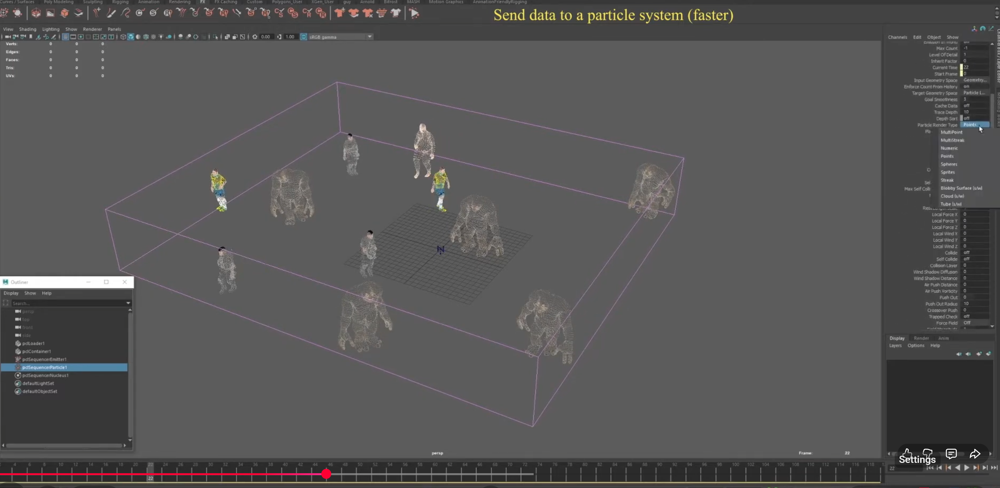
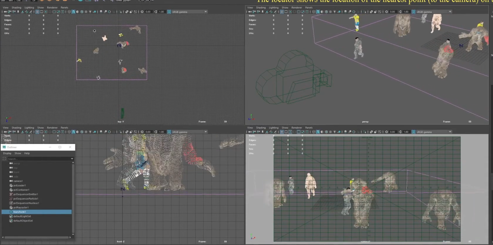
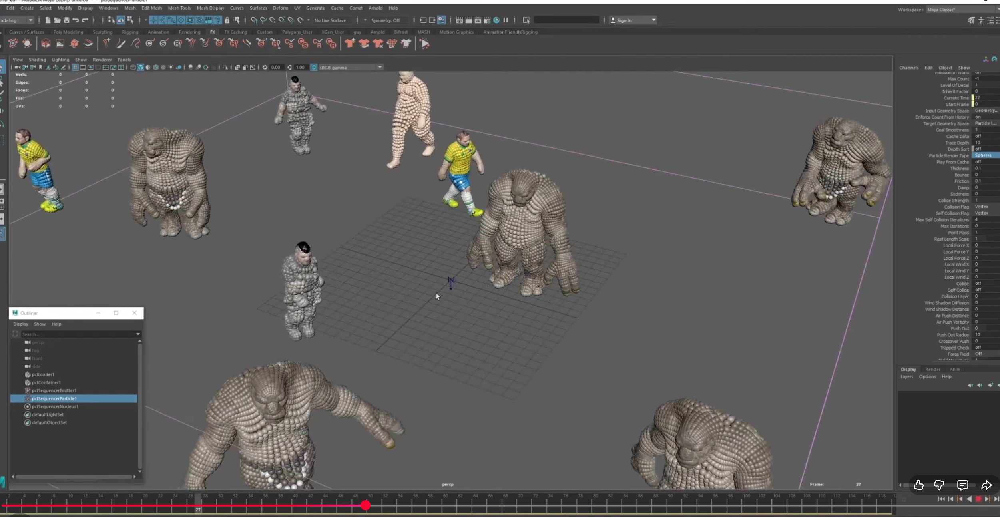
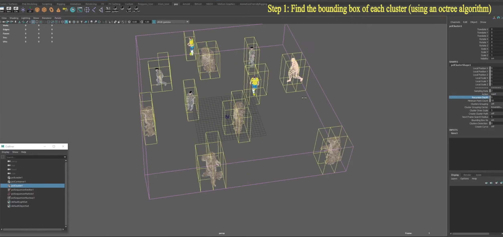
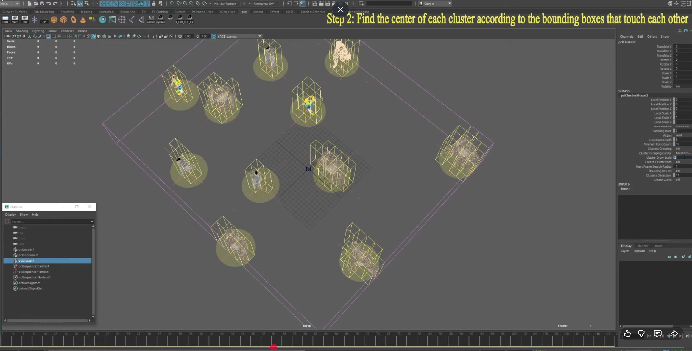
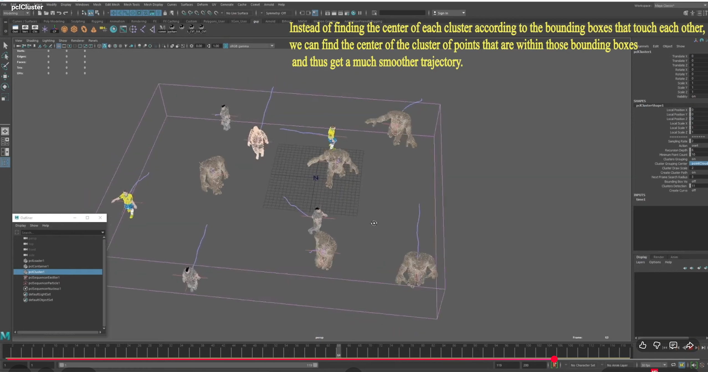
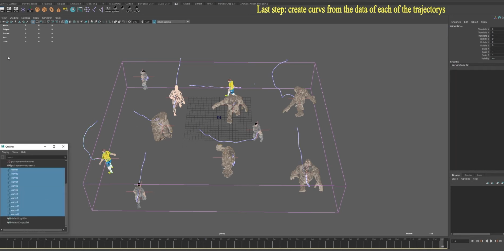
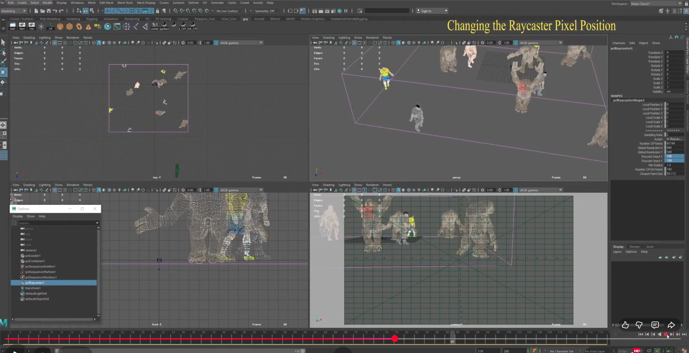
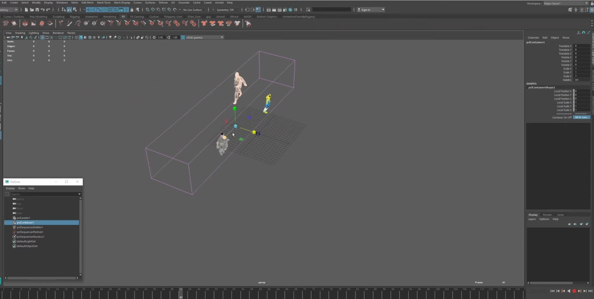

# PCL Loader Plugin Suite for Maya

A comprehensive Maya plugin suite for loading, processing, and
visualizing point cloud data (PCL/PLY files) with advanced features
including container filtering, raycasting, clustering, and particle
system integration.

## TL;DR

-   **Point Cloud Loading**: Load single files or sequences of PCL/PLY
    point cloud data.
-   **Timeline Playback**: Real-time point cloud updates as you scrub
    through the timeline.
-   **Container Filtering**: Interactive bounding box container to
    filter points (inside/outside).
-   **Raycasting**: Mark and color points visible in a specific camera
    view.
-   **Clustering**: Automatic cluster detection with trajectory tracking
    and curve generation.
-   **Particle System Integration**: Display point data to Maya's
    nParticle system.
-   **Multithreaded Loading**: Parallel file loading prevents Maya UI
    freezing.

------------------------------------------------------------------------

## Demo

## ▶ Video Showcase (3 in a row)

<p align="center">
  <a href="https://www.youtube.com/watch?v=hNdi2yLKMfU">
    
  </a>
  <a href="https://www.youtube.com/watch?v=ksgL64EMrjg">
    
  </a>
  <a href="https://www.youtube.com/watch?v=tLRw0yPXXZ8">
    
  </a>
</p>


---

## 🖼 Image Gallery (3×3 Grid)

pclLoader
<table> <tr> <td></td> <td></td> <td></td> </tr> </table>

pclCluster
<table> <tr> <td></td> <td></td> <td></td> </tr> </table>

pclRaycaster
<table> <tr> <td></td> <td></td> <td></td> </tr> </table>

------------------------------------------------------------------------

## Overview

This plugin suite provides a complete solution for working with
point-cloud sequences inside Maya. It was originally developed to
support the needs of my team at Intel, handling large PLY/PCD datasets,
frame-by-frame playback, interactive filtering, and generating
point-cloud-derived information such as raycast hits or player
trajectories.

The system follows a modular architecture: every feature is implemented
as an independent Maya node. Each node focuses on a single
responsibility while receiving its input from the central pclLoader node
via Maya's dependency graph, keeping the workflow efficient, stable, and
easy to extend.

This modular design allows each component to evolve independently and
makes the suite maintainable and scalable.

------------------------------------------------------------------------

# Node Breakdown (High-Level Responsibilities)

## pclLoader - The Central Data-Source Node

The main node that loads and caches point cloud sequences.

### Features:

-   Multithreaded file loading for performance (prevents UI freezing and
    dramatically speeds up heavy file loading).
-   Row skipping point downsampling via `skipRows` parameter
    (downsamples extremely heavy clouds and accelerates loading).
-   Supports single files, folders, and numbered sequences (with `#`
    pattern).
-   Container-based point filtering (show inside/outside).
-   Real-time frame updates based on timeline.

------------------------------------------------------------------------

## pclSequencer - Point-Cloud Display (nParticles)

Visualizes point-cloud frames in Maya.

### Features:

-   Receives positions/colors from pclLoader.
-   Connects to nParticle emitter and nucleus.
-   Enables smooth real-time playback using Maya's GPU nParticles
    system.
-   Save point data to PCD/PLY files.

------------------------------------------------------------------------

## pclRaycaster - Camera-Based Raycasting

Marks points visible in a connected camera.

### Features:

-   Raycast from 2D screen coordinates to 3D point cloud (shoots rays
    through pixel coordinates from any selected Maya camera).
-   Finds the closest hit within a configurable radius and returns the
    closest hit point.
-   Highlights hit points for visual inspection or labeling.

------------------------------------------------------------------------

## pclCluster - Player Separation & Trajectory Extraction

Performs spatial clustering on point clouds.

### Features:

-   Octree-based spatial subdivision (splits clouds into distinct
    clusters/players).
-   Cluster center calculation.
-   Trajectory tracking across frames.
-   Automatic NURBS curve (paths) generation from cluster trajectories.

------------------------------------------------------------------------

## Architecture

The plugin suite follows a modular architecture:

- **Core Library** (`core/`): Maya-independent modules
  - `pclFrameCache`: File loading and caching
  - `pclGeometryUtils`: Geometric utilities (bounding boxes, filtering)

- **Maya Adapters** (`pclLoader/`, `pclRaycaster/`, etc.): Maya-specific nodes
  - Convert between Maya types and core library types
  - Handle Maya dependency graph connections
  - Viewport drawing and visualization

- **Shared Utilities** (`pclUtilities`, `pclCommandHelpers`): Reusable Maya-aware functions

### Data Flow

```
pclLoader (loads files, filters by container)
    ↓ (outPointsPosition, outPointsColor)
    ├→ pclRaycaster (raycasting/frustum culling)
    ├→ pclCluster (spatial clustering)
    └→ pclSequencer (particle system export)
```

## Performance

- **Multithreaded Loading**: Automatically uses multiple CPU cores for parallel file loading
- **Frame Caching**: Loaded frames are cached to avoid redundant I/O
- **Optimized Arrays**: Pre-allocated arrays and cached length calls for performance
- **Connection-Based**: Nodes communicate via Maya's dependency graph (efficient)


# Architecture Diagram

                     ┌────────────────────────────────────┐
                     │              pclLoader              │
                     │   (Loads + Filters + Cache +        │
                     │        Container Filtering)         │
                     └────────────────────────────────────┘
                                   │
                                   ▼
                     ┌────────────────────────────────────┐
                     │             pclSequencer            │
                     │       (Displays points via          │
                     │              nParticles)            │
                     └────────────────────────────────────┘


                        Additional Processing Nodes:

          ┌────────────────────────────┐      ┌────────────────────────────┐
          │        pclRaycaster        │      │         pclCluster         │
          │        (Raycasting)        │      │   (Clusters + Trajectories)│
          └────────────────────────────┘      └────────────────────────────┘

------------------------------------------------------------------------

## Project Structure

```markdown
📁 pcl_loader/
│
├── 📁 src/
│   │
│   ├── 📁 pclLoader/
│   │   ├── 📁 core/
│   │   │   ├── 📄 pclFrameCache.cpp
│   │   │   ├── 📄 pclFrameCache.h
│   │   │   ├── 📄 pclGeometryUtils.cpp
│   │   │   ├── 📄 pclGeometryUtils.h
│   │   │
│   │   ├── 📄 pclLoader.cpp
│   │   ├── 📄 pclLoader.h
│   │   ├── 📄 pclLoaderCmd.cpp
│   │   ├── 📄 pclLoaderCmd.h
│   │   ├── 📄 pclCommandHelpers.cpp
│   │   ├── 📄 pclCommandHelpers.h
│   │   ├── 📄 pclContainer.cpp
│   │   ├── 📄 pclContainer.h
│   │   ├── 📄 pclUtilities.cpp
│   │   ├── 📄 pclUtilities.h
│   │   └── 📄 pluginMain.cpp
│   │
│   ├── 📁 pclSequencer/
│   │   ├── 📄 pclSequencer.cpp
│   │   ├── 📄 pclSequencer.h
│   │   ├── 📄 pclSequencerCmd.cpp
│   │   ├── 📄 pclSequencerCmd.h
│   │
│   ├── 📁 pclRaycaster/
│   │   ├── 📄 pclRaycaster.cpp
│   │   ├── 📄 pclRaycaster.h
│   │   ├── 📄 pclRaycasterCmd.cpp
│   │   ├── 📄 pclRaycasterCmd.h
│   │
│   ├── 📁 pclClustering/
│   │   ├── 📄 pclCluster.cpp
│   │   ├── 📄 pclCluster.h
│   │   ├── 📄 pclClusteringCmd.cpp
│   │   ├── 📄 pclClusteringCmd.h
│   │
│   └── 📁 (additional helper files if needed)
│
├── 📁 tests/
│   ├── 📄 README.md
│   ├── 📄 testRunner.cpp
│   ├── 📄 pclUtilitiesTests.cpp
│   │
│   ├── 📁 core/
│   │   ├── 📄 pclFrameCacheTests.cpp
│   │   ├── 📄 pclGeometryUtilsTests.cpp
│
├── 📁 media/
│   ├── 🖼 clustering_step1.png
│   ├── 🖼 clustering_step2.png
│   ├── 🖼 clustering_step3.png
│   ├── 🖼 clustering_step4.png
│   ├── 🖼 display_particles_type.png
│   ├── 🖼 load_point_cloud_sequences.png
│   ├── 🖼 only_points_inside_container.png
│   ├── 🖼 raycaster_from_cam_center.png
│   ├── 🖼 raycaster_from_cam_pixel_pos.png
│
├── 📄 README.md
├── 📄 USAGE.md
└── 📄 .gitignore

```

------------------------------------------------------------------------

## Installation

1. Copy the compiled `.mll` file to your Maya plugin directory:
   ```
   [Maya Install Path]/bin/plug-ins/
   ```
2. Load the plugin in Maya:
   - **Maya 2016+**: Windows → Settings/Preferences → Plug-in Manager
   - Or use: `loadPlugin pclLoader.mll;`

------------------------------------------------------------------------
## Usage

### Basic Workflow

1. **Load Point Cloud Sequence**:
   ```
   pclLoaderCmd -mainPath "path/to/sequence/frame_####.ply" -name "myLoader";
   ```

2. **Create Raycaster** (optional):
   ```
   pclRaycasterCmd -name "myRaycaster" -pclLoader "myLoader" -selCamera "camera1";
   ```

3. **Create Cluster** (optional):
   ```
   pclClusteringCmd -name "myCluster" -pclLoader "myLoader";
   ```

4. **Create Sequencer** (optional):
   ```
   pclSequencerCmd -name "mySequencer" -pclLoader "myLoader";
   ```
For full usage examples and command reference, see **USAGE.md**.
------------------------------------------------------------------------


For full usage documentation, see [docs/USAGE.md](USAGE.md)

# Dependencies

-   Maya C++ SDK 2016 (MPxEmitterNode, MPxCommand).
-   Open3D Latest (point-cloud loading and saving: PLY/PCD).
-   Eigen3 3.x (3D math (core library)).
-   Boost 1.50+ Libraries (Filesystem, string utilities).
-   Standard C++11/14 multithreading, containers, algorithms.
-   Visual Studio 2013+.

------------------------------------------------------------------------

# Build Requirements

-   Maya: 2016 or later\
-   Visual Studio: 2013 or later (2015+ recommended for full C++11/14
    support)\
-   Dependencies:
    -   Open3D (for PCL/PLY loading)\
    -   Boost.Filesystem (for path operations)\
    -   Eigen3 (for 3D math operations)

------------------------------------------------------------------------

# Building

1.  Open the Visual Studio solution file\.
2.  Configure build settings:
    -   Set Maya SDK path\
    -   Set Open3D, Boost, and Eigen include/library paths\
    -   Ensure C++11 or later standard is enabled\.
3.  Build the solution in Release mode\.
4.  Copy the generated `.mll` file to Maya's plugin directory.

------------------------------------------------------------------------

## Troubleshooting

### Plugin Won't Load
- Verify Maya version compatibility (2016+).
- Check that all dependencies (Open3D, Boost, Eigen) are properly linked.
- Ensure Visual Studio runtime libraries are available.

### Files Won't Load
- Verify file paths use forward slashes or escaped backslashes.
- Check that files have `.ply` or `.pcd` extensions.
- Ensure Open3D can read the file format.

### Performance Issues
- Reduce `skipFilesRows` for faster loading (but less points).
- Adjust `recursionDepth` in cluster node for faster clustering.
- Use container filtering to reduce point count.

------------------------------------------------------------------------

## Version
**Current Version**: 1.0.1  
**Maya Compatibility**: 2016+  
**Build System**: Visual Studio 2013+

## Status
Legacy plugin.  
Designed for Maya 2016, Visual Studio, Open3D, Boost.  
Kept publicly to demonstrate experience with C++, Maya API, geometry processing, multithreading, and point-cloud tooling.  
Not actively maintained.

## License
Copyright (c) Guy Perry.  
For portfolio and educational purposes only.  
Unauthorized use, copying, or distribution is prohibited.
